<div align="center">


<br />

[](https://github.com/prakash116)
[](https://github.com/prakash116?tab=followers)
[](mailto:prakashmanig000@gmail.com)

</div>

<div align="center">

### 🧠 Where ideas become intelligent experiences



</div>

## 👋 About me

```javascript
const prakash = {
  title: "Full-Stack & Mobile App Developer",
  company: "Restro Edge Pvt. Ltd.",
  experience: "3+ years",
  focus: ["MERN Stack", "React Native", "REST APIs"],
  platforms: ["Web", "Android", "iOS"],
  currentlyBuilding: ["RestoCare Customer App", "RestoCare Partner App"],
  mindset: "Build clean. Ship value. Keep learning."
};
```

I build responsive web products and cross-platform mobile apps from idea to release. My work covers frontend architecture, backend APIs, authentication, state management, database design, and polished user experiences.

- 🔭 Currently building the **RestoCare Customer** and **Partner** apps
- 🌱 Exploring scalable architecture, performance, and better developer experiences
- 💬 Ask me about **React, React Native, Node.js, Express, MongoDB, or Redux**
- ⚡ I enjoy turning complex workflows into simple, useful products

## 🚀 What I do

<table>
<tr>
<td width="33%" align="center" valign="top">

### 🌐 Web

Responsive, accessible interfaces with reusable components and thoughtful state management.

</td>
<td width="33%" align="center" valign="top">

### 📱 Mobile

Cross-platform Android and iOS apps built with React Native and Expo.

</td>
<td width="33%" align="center" valign="top">

### ⚙️ Backend

Secure REST APIs, authentication, business logic, and database integrations.

</td>
</tr>
</table>

## 🧰 Technology toolbox

<div align="center">

### Frontend & mobile


### Backend & data


### Tools & delivery


</div>

## 📊 GitHub activity

<div align="center">


<br /><br />


<br /><br />

<!-- Generated by .github/workflows/snake.yml — the snake appears after the workflow's first run on GitHub -->
<picture>
  <source media="(prefers-color-scheme: dark)" srcset="https://raw.githubusercontent.com/prakash116/prakash116/output/github-snake-dark.svg" />
  <source media="(prefers-color-scheme: light)" srcset="https://raw.githubusercontent.com/prakash116/prakash116/output/github-snake.svg" />
  
</picture>

</div>

## 🤝 Let's connect

<div align="center">



<br />

[](https://www.linkedin.com/in/prakashmani87/)
[](mailto:prakashmanig000@gmail.com)
[](https://www.instagram.com/prakash._mani/)
[](https://www.facebook.com/prakash.mani.98478672)

<br /><br />

<sub>⚡ Designed with curiosity, built with purpose, and always evolving.</sub>

</div>
